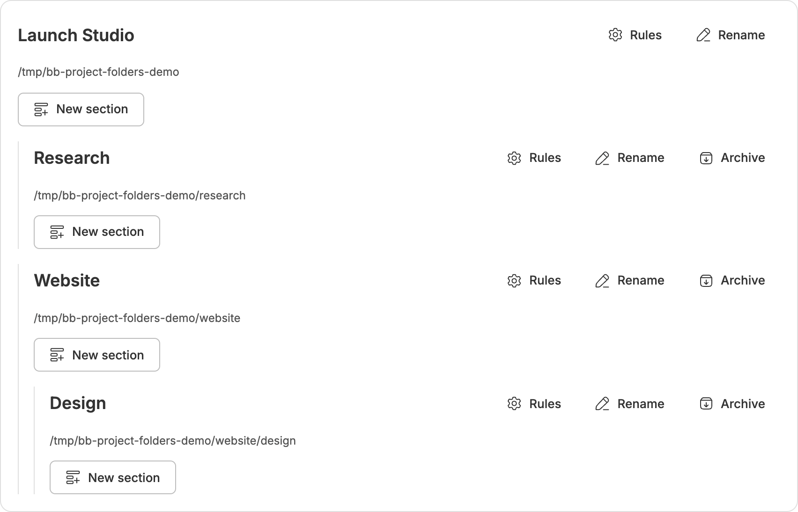
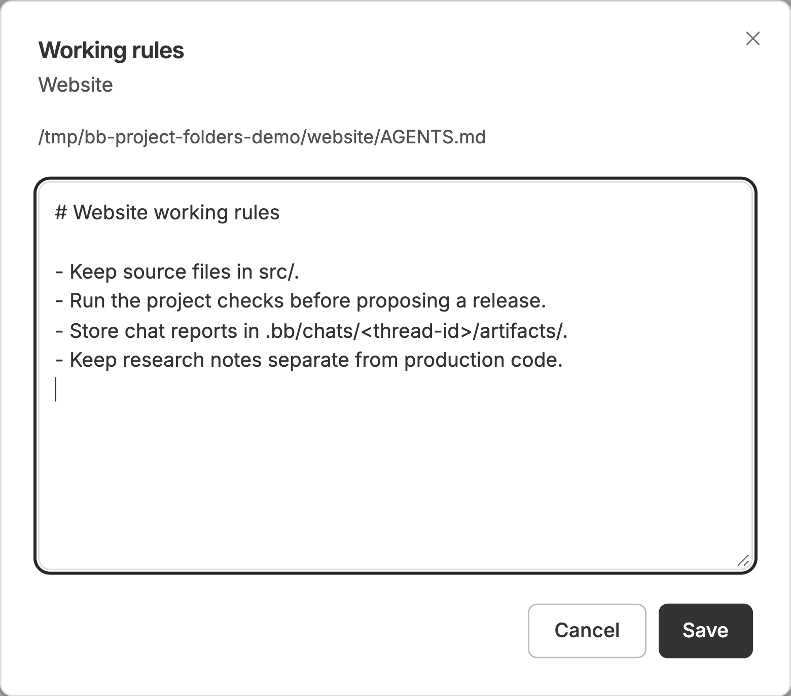

# Проекты и разделы — плагин BB

Самостоятельный плагин; ядро BB не изменяется.

## Как это выглядит

В одном проекте можно держать сайт, исследования и дизайн. Каждый раздел соответствует реальной папке на выбранном устройстве и может содержать собственные чаты и правила работы.



*Снимок работающего плагина с демонстрационными данными. Видны вложенные разделы, правила, переименование и архивирование.*

Например, структуру можно организовать так:

```text
Мой проект                        Проект
├── Общее планирование            Чат в корне проекта
├── Исследования/                 Папка раздела
│   └── Анализ потребностей       Чат в разделе
└── Сайт/                         Папка раздела
    ├── Создание лендинга          Чат в разделе
    └── Дизайн/                   Папка подраздела
        └── Проверка макета       Чат в подразделе
```

Чат на уровне проекта может работать со всеми его папками, если рабочей средой выбран корень проекта. Чат раздела открывается с рабочей папкой этого раздела. Экспорт истории и служебные материалы размещаются в скрытой `.bb/chats/`.

## Начать работу

1. Создайте проект, выберите устройство и папку.
2. В меню **⋯** выберите **Новый раздел** — создайте папку или укажите существующую.
3. Нажмите значок **чата с плюсом** у раздела: откроется стандартный редактор BB с нужной рабочей папкой.
4. При необходимости задайте **Правила работы** для раздела.
5. Завершённый раздел отправьте **В архив**. Позже его можно восстановить из списка архивов или при повторном использовании названия.

## Правила рядом с работой

У сайта могут быть свои правила разработки, у исследований — требования к источникам. Редактор сохраняет их в `AGENTS.md` выбранной папки. Инструкции агенту также указывают читать применимые правила родительских папок.



Так проще вести несколько направлений внутри проекта: чаты открываются в нужных папках, отчёты имеют отдельное место, а завершённые разделы можно убрать из рабочего дерева с возможностью восстановления.

### Правила по умолчанию для новых разделов

В настройках плагина есть переключатель **Автосоздание AGENTS.md** и два шаблона — **для проектов** и **для разделов**. Готовые пресеты написаны на английском (агентам дешевле по токенам) и сочетают рабочую дисциплину проектов с правилами кодинга по Карпатому; редактируйте их свободно в настройках плагина. При создании проекта, раздела или подраздела плагин вписывает подходящий шаблон в конец `AGENTS.md` этой папки между служебными метками:

```
<!-- bb-project-folders:agents:start -->
…ваши инструкции по умолчанию…
<!-- bb-project-folders:agents:end -->
```

Текст выше меток никогда не меняется. Если файл уже существует, блок дописывается в конец; при изменении шаблона обновляется тот же блок между метками. Кнопка **Применить к существующим разделам** вписывает действующие шаблоны во все проекты и разделы сразу (кроме тех, что оставлены на вкладке **Свой файл**) и показывает, сколько обновлено, без изменений и с ошибками.

Правила иерархические. В настройках плагина — общие значения по умолчанию. У выбранного проекта или раздела на странице плагина три вкладки — **По умолчанию**, **Свой шаблон** и **Свой файл**: что открыто, то и применяется после сохранения. На вкладке **Свой файл** видны сами `AGENTS.md` и `CLAUDE.md` выбранного устройства, и плагин в них ничего не пишет: ни шаблона, ни блока своих правил, а «Применить к существующим разделам» такую папку пропускает. Папка, в AGENTS.md которой нет служебных меток (то есть файл писали вы), открывается на этой вкладке сама. На вкладке **Свой шаблон** задаются **свои настройки проекта**: отдельный шаблон для корня этого проекта и отдельный шаблон для новых разделов внутри него. Разделы первого и второго уровня могут задать свой шаблон так же — действует ближайшее переопределение, иначе правило проекта, иначе общее. **Разделы третьего уровня правил не получают** — действие «Правила» для них скрыто, и шаблон туда не вписывается.

Ручной порядок: перетаскивайте проекты и разделы вверх и вниз по дереву или используйте пункты **Сдвинуть вверх / Сдвинуть вниз** в меню строки. Порядок хранится в базе плагина и действует на странице плагина и в сайдбаре.

## Интерфейс

- **Новый проект** доступен в дереве, в меню проекта и на странице плагина. Диалог создаёт обычный проект BB: название, подключённое устройство, существующая или новая папка.
- **Новый раздел** создаёт папку внутри проекта или другого раздела. Можно выбрать источник проекта на Mac mini или MacBook. Устройства без источника проекта показаны с объяснением; вложенный раздел остаётся на устройстве родителя.
- Кнопка папки открывает просмотр каталогов выбранной машины. Существующие файлы сохраняются.
- Иконка чата использует стандартный редактор BB. Контрол проекта в редакторе становится деревом проектов и разделов, поэтому новый чат можно привязать к корню проекта или любому вложенному разделу до отправки; выбранные модель и вложения сохраняются.
- Страница плагина показывает дерево разделов, правила AGENTS.md, переименование и архивы. Переименование раздела меняет подпись, сохраняя путь. Конкурентные изменения AGENTS.md проверяются по SHA.

## Сортировка и длина списка

В меню **⋯ → Сортировка чатов** проекта или раздела можно выбрать сортировку по активности, по алфавиту или по дате создания. По умолчанию используется активность: новые обновления и события внимания BB поднимают чат внутри его проекта или раздела. Закреплённые чаты остаются сверху.

Лимит задаётся в **Настройках** на странице плагина. Сначала показываются **10 чатов**. Лимит можно изменить от 1 до 100; он применяется отдельно к каждому проекту, разделу и списку без проекта. **Показать все** разворачивает только выбранный список, **Свернуть список** возвращает лимит. Настройки сохраняются в текущем браузере.

## Служебные файлы

```
<проект или раздел>/
  AGENTS.md
  .bb/chats/<id-чата>/
    thread.json
    history/index.json
    history/<snapshot>/page-00000.json
    artifacts/
    notes/
    tmp/
```

BB остаётся основным хранилищем чатов. Плагин экспортирует многостраничную историю при создании, завершении ответа и архивировании чата. Индекс публикуется после завершения снимка; предыдущий снимок удаляется. Бинарные вложения остаются в BB. Инструкции агенту направляют заметки и документы переписки в служебные папки; рабочий код остаётся в структуре проекта. Это организация файлов, не ограничение доступа.

## Архив

**Архивировать** перемещает весь раздел вместе с вложенными разделами в `<корень проекта>/.bb/archive/sections/<id>/folder`. Рядом сохраняется manifest.json. Чаты архивируются и блокируются для новых сообщений до восстановления. Работающие чаты, очереди и вложенные источники других проектов предотвращают перенос.

**Восстановить** возвращает исходный путь, прежние ID разделов и неархивированные ранее чаты. Занятая исходная папка не перезаписывается. При создании раздела с именем из архива на том же устройстве предлагается восстановить прежний раздел с историей либо явно создать новый.

Журнал операций переживает отключение устройства или перезапуск. На странице архива есть **Повторить** для незавершённых операций. Безвозвратное удаление архивов не предусмотрено. Старые разделы, убранные до появления архива, автоматически не перемещаются.

## Удалить проект

В меню **⋯** проекта или на карточке выберите **Удалить**. По умолчанию стоит **Не трогать файлы**: карточка и чаты проекта исчезают из BB, папка на диске остаётся. **Перенести файлы в архив** перекладывает единственную локальную папку в `<родитель>/.bb/archive/projects/<id>/folder`. Если эта папка ещё и раздел другого проекта или внутри неё другой проект BB, перенос файлов будет отказан — оставьте «Не трогать файлы». Удалённый GitHub-репозиторий при этом не трогается.

## Один проект, много устройств

У проекта может быть своя рабочая копия на каждом устройстве: макбуке, Mac mini, сервере. Откройте **Рабочие копии** в меню **⋯** корня проекта или на карточке, выберите устройство и папку — плагин создаст папку, если её нет, впишет правила AGENTS.md и зарегистрирует источник проекта. В дереве проект остаётся одной строкой, а на карточке копии переключаются вкладками устройств: у каждой копии свой путь, свои разделы, чаты и AGENTS.md. Вкладки показывают **все** машины BB, а не только те, где копия уже есть: на машине без копии карточка говорит «Копии проекта на этой машине нет» и предлагает **Добавить копию** — диалог откроется с уже выбранным устройством. Залитая молния во вкладке означает, что машина сейчас на связи; приглушённая вкладка — что копии проекта там нет.

Путь копии показан полем рядом с вкладками, а кнопка рядом открывает выбор папки: обзор устройства с возможностью создать папку. Если выбрать папку, в которой проекта ещё нет, — кнопка станет **Перенести**, и папка переедет со всем содержимым. Если в выбранном месте уже лежит папка проекта — кнопка станет **Использовать эту папку**, и плагин просто перепривяжет проект, ничего не перемещая. Тот же выбор доступен для каждой копии в диалоге **Рабочие копии**. В диалогах новых чатов доступно каждое устройство, где есть копия. Последнюю копию убрать нельзя; копию с разделами или чатами сначала нужно очистить.

## Перенести проект

Нажмите **Перенести** на карточке проекта или в меню **⋯**. Выберите родительскую папку и подтвердите новый путь. Перемещается вся папка проекта: рабочие и скрытые файлы, правила, разделы, экспорт чатов и архив. Пути проекта и разделов обновляются.

На старом месте остаётся символическая ссылка для существующих рабочих сред BB. Сохраняйте её, пока старые чаты используют этот путь. Центральная база BB, бинарные вложения и файлы за пределами папки проекта не перемещаются. Источник проекта на другом устройстве остаётся на месте.

Перенос поддерживается **на том же устройстве и разделе диска**, в ещё не существующую папку. Работающие чаты и очереди нужно завершить. Домашний каталог, папки инфраструктуры BB, связанные Git worktree и проекты с рабочими средами за пределами своей папки этим способом не переносятся. После прерывания на странице плагина появится **Повторить**; новые сообщения блокируются до завершения переноса.

## CLI

```
bb project-folders list --json
bb project-folders create <project-id> <parent-id-or-dash> <name> <relative-path> [host-id]
bb project-folders copy-add <project-id> <host-id> <path>
bb project-folders copy-remove <project-id> <host-id>
bb project-folders sync <thread-id>
bb project-folders archive <folder-id>
bb project-folders archives --json
bb project-folders restore <archive-id>
bb project-folders delete-project <project-id> keep|archive
```

`forget` оставлен как псевдоним `archive`.

## Разработка

```
npm install
npx tsc --noEmit
npx vitest run
bb plugin build
bb plugin install . --yes
```

Компоненты диалогов, меню и иконок скопированы из BB shared-ui; runtime использует публичный Plugin SDK. Тесты проверяют маршрутизацию по устройствам, сохранность файлов, конфликты, архивирование/восстановление дерева и истории, а также повтор после сбоя переноса.

## Языки и совместимость

Английский используется по умолчанию. На странице управления доступны 11 языков: английский, русский, испанский, французский, немецкий, португальский, упрощённый китайский, японский, корейский, хинди и арабский. Выбор сохраняется в браузере. Диагностика сервера и автоматически создаваемая документация — на английском.

Поддерживаются локальные источники проектов на macOS и Linux; живая проверка выполнена на macOS. Пути Windows пока не поддерживаются. Перед отключением плагина восстановите архивные разделы, если хотите продолжать пользоваться их чатами. Архив и экспорт истории не заменяют резервную копию базы BB и хранилища плагина.

### Перенос существующих чатов (нужен патч ядра BB)

Правый клик по чату открывает то же меню, что и `…`. Для переноса выберите «Переместить в подраздел…» либо перетащите чат на раздел или корень проекта. Перенос сохраняет ID и историю, меняет рабочую папку и перемещает только служебную папку `.bb/chats/<id>`. Исходники проекта не переносятся. Чат должен закончить работу; устройство и проект остаются прежними.

**Для переноса необходим [патч ядра BB 0.43.1](docs/bb-native-thread-relocation.patch).** Обычные BB 0.43.0/0.43.1 пока не предоставляют нужный API. На неподдерживаемом сервере операция завершится ошибкой без переноса файлов. Патч также скрывает нативный браузер при открытии диалогов плагина; обновлённый интерфейс должен загрузиться в настольном клиенте. При сбое переноса файлов повторите то же назначение — журнал восстановления сохраняется.

Без патча остальные возможности плагина работают в обычном режиме: недоступен только перенос существующих чатов.

### Выбор папки

Проекты и подразделы используют общий компактный список, адаптированный из RemotePathBrowser BB. Кнопка папки с плюсом создаёт вложенную папку на выбранном устройстве. Корзина запрашивает подтверждение и удаляет только пустые папки, не привязанные к проектам или разделам. Для разделов с историей используйте архивирование.
